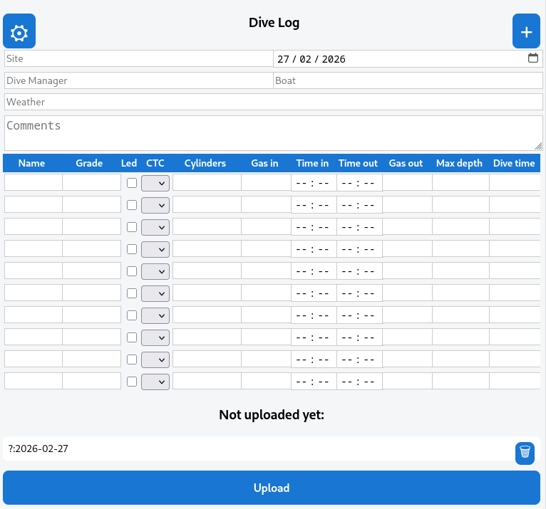
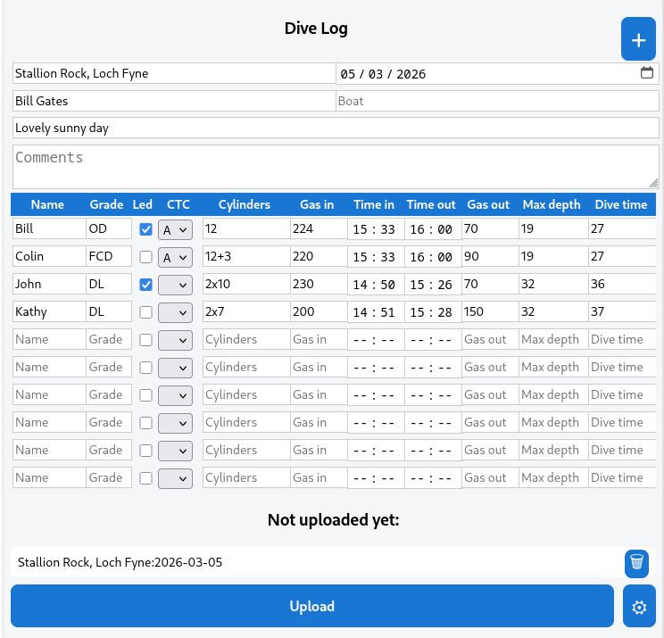

# DiveLog
Web app to capture dive logs and upload them to the cloud. The app is written specifically for [BSAC](http://bsac.com) Dive Managers who need to submit dive logs to their Diving Officer. The idea is to append dive log data to a spreadsheet that your Diving Officer can review and analyse.


Supported cloud services include a spreadsheet on Google Drive, and upload to a custom server, but it should be fairly straightforward to add other cloud stores (for example Microsoft OneDrive).

The app is hosted on https://cdot.github.io/DiveLog, or you can clone your own copy and host it yourself if you want to make changes.

# Usage
1 Visit the host website to Open the app in your browser.
2 The first time you open the app in a browser, you should to click on the
gear icon in the top left and paste the upload key your system
administrator or Diving Officer has given you (you can do this later when you come to upload if that works better for you).
3 Enter your dives. You can enter as many as you like, they will be cached
locally e.g. if you don't have internet access.
4 When you have internet again, click "Upload" to upload your dive logs. You will probably be asked for login information for the cloud store.


# Technical
You need some technical nous for this bit. The app is configured from a `|`-separated key string that you give to your users. The key may have many fields, depending on the requirements of the store implementation, but the first field is always the name of the store class to use, `DriveSheet` or `PostStore` (it should be fairly easy for you to implement other upload interfaces e.g `WebDAVStore` or `OneDriveStore`).

## Stores

### Spreadsheet on Google Drive
In order to upload data to Google Sheets, you have to have a Google Project.
You can follow the steps described [here](https://www.thebricks.com/resources/guide-how-to-use-google-sheets-api-in-javascript).
The store needs two fields in the key. The second field is a client id (from the google project) and the third is a spreadsheet id (extracted from the URL of your spreadsheet. The final key looks like this:
```
DriveSheet|<client id>|<spreadsheet id>
```
for example
```
DriveSheet|911230958074-jqbsdoiqv6n243jf92kas09f9akf30r8.apps.googleusercontent.com|12afg07wf-7ikjhkjhKJUUfFijT798gjgfUktgfdpi7Y
```
The spreadsheet you upload to must have a page called "Dives" in it, and must be writable by the people who will be uploading dive logs.

### POST store
If you have your own server implementation (e.g. using `express`) you can POST
to the server to upload CSV data to the store. The URL endpoint is required in the key. For example:
```
PostStore|https://my.server/uploadDiveLogs
```
The DiveLogs repository includes an implementation of a suitable server in `src/PostCSVServer.js`.

