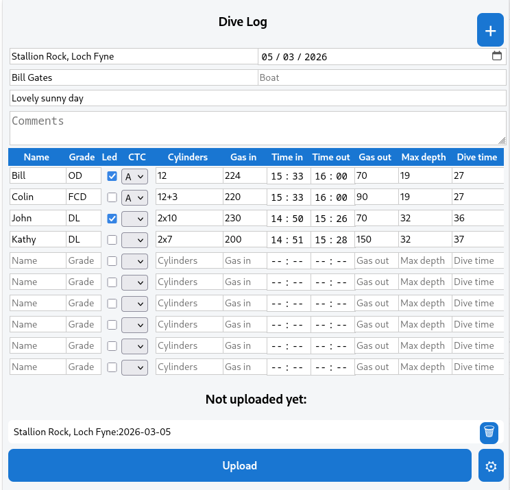
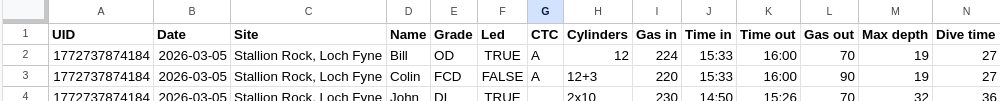

# DiveLog

Web app to capture dive logs and upload them to the cloud. The app is written specifically for [BSAC](http://bsac.com) Dive Managers who need to capture and submit dive logs to their Diving Officer. It allows offline capture of dive logs, and upload once internet is available again. Dive logs can be automatically appended to a spreadsheet in the cloud that your Diving Officer can review and analyse.



Cloud services supported by default are Google Drive and a custom server, but it should be fairly straightforward to add other services.



The app can be used at [https://cdot.github.io/DiveLog](https://cdot.github.io/DiveLog), or you can clone your own copy and host it yourself. It should work in any browser that supports HTML5.

# Usage

1. Visit the host website to open the app in your browser.
2. (Optional, first time only) click on the gear icon in the bottom right and paste the upload key that your system administrator or Diving Officer has given you (you can do this any time before you upload).
3. Enter your dives. You can enter as many as you like, they will be recorded locally.
5. When you have internet again, click "Upload" to upload your recorded dive logs. You will probably be asked for login information for the cloud store.

# System Administrators

The upload function is configured from an "upload key" that you give to users. This is a `|`-separated key string that may have many components, depending on the requirements of the store implementation. The first component is always the name of the store class to use, e.g. `DriveSheet` or `PostCSV`. The remaining components differ for each different type of upload targets. It should be fairly easy to implement other upload interfaces e.g `WebDAVStore` or `OneDriveStore` if you need them.

## Stores

### Spreadsheet on Google Drive

(Technobabble: Unfortunately Google makes this more clumsy than it should be, due to the constraints of OAuth and CORS. We have to use Cloudflare as a proxy.)

1. In the browser, log in to Google Drive as the user who is going to own the spreadsheet.
   - Create the spreadsheet. Select Extensions -> Apps Script and paste the content of [DriveSheet_AppScript.js](src/DriveSheet_AppScript.js)
   - Deploy - New deployment - Web App, Execute as Me, Anyone has access
   - Copy the appscript deployment ID e.g. `AKffhgkY4a1umthcAfpkHoaeksPWtAT-q4KBZa5SJVHKyXF-MYZfk8KeDqrn8CjJkMuFIteb` and keep it safe.
4. Log in to your [Cloudflare](https://cloudflare.com) account (Start for Free if necessary)
   - Developer Platform -> Start Building -> Start with Hello World! -> Deploy -> Edit Code
   - Delete the Hello World! code, and paste in the content of [DriveSheet_CloudflareWorker.js](src/DriveSheet_CloudflareWorker.js)
DeployCreate a new worker (UI keeps changing, so you'll have to work out how)
6. Create a "Hello World!" worker
7. Click "Edit code" and paste the content of `src/DriveSheet_CloudflareWorker.js`
8. Deploy the worker. Copy the cloudflare deployment ID  e.g. `sheet-proxy-d909.myusername.workers.dev`.
9. Make a key for sharing with your users in the format `DriveSheet|<cloudflare ID>|<appscript ID>` e.g.
```
DriveSheet|sheet-proxy-d909.myusername.workers.dev|AKffhgkY4a1umthcAfpkHoaeksPWtAT-q4KBZa5SJVHKyXF-MYZfk8KeDqrn8CjJkMuFIteb
```
By default the data will be uploaded to the first sheet in the spreadsheet where the App Script is deployed. You can optionally add a spreadsheet id and a sheet name to the key if you want to control this: `DriveSheet|<cloudflare ID>|<appscript ID>|<spreadsheet ID>|<sheet name>`. 

### POST store

If you have your own server you can POST to the server to upload CSV data to the store. The key format is `PostCSV|<endpoint URL>|<username>|<password>` e.g. `PostCSV|https://my.server/uploadDiveLogs|myuser|secret`. The repository includes a trivial node.js implementation of a suitable server in [PostCSVServer.js](src/PostCSVServer.js).

### Excel sheet on Microsoft OneDrive

There is an untested implementation for OneDrive, written by ChatGPT. It might work, but you will probably need a similar proxy approach as used for Google Drive to avoid issues with OAuth.
