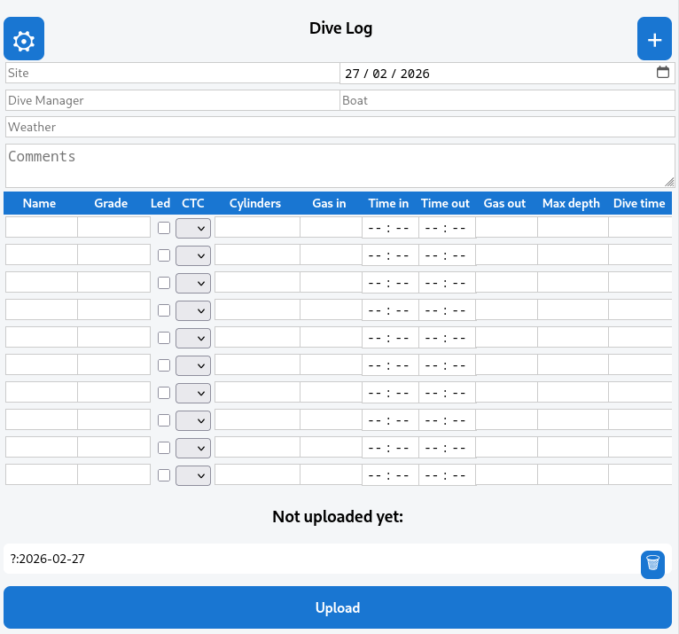

# DiveLog
Web app to capture dive logs and upload them to the cloud. The app is written specifically for [BSAC](http://bsac.com) Dive Managers who need to capture and submit dive logs to their Diving Officer. It allows offline capture of dive logs, and upload once internet is available again. Dive logs can be automatically appended to a spreadsheet in the cloud that your Diving Officer can review and analyse.


Supported cloud services include a spreadsheet on Google Drive, and upload to a custom server, but it should be fairly straightforward to add other cloud stores (an example Microsoft OneDrive module is included).

The app can be used at [https://cdot.github.io/DiveLog](https://cdot.github.io/DiveLog), or you can clone your own copy and host it yourself. It should work in any browser that supports HTML5.

# Usage
1 Visit the host website to open the app in your browser.
2 (Optional, first time only) click on the gear icon in the bottom right and paste the upload key that your system administrator or Diving Officer has given you (you can do this any time before you upload).
3 Enter your dives. You can enter as many as you like, they will be recorded locally.
5 When you have internet again, click "Upload" to upload your recorded dive logs. You will probably be asked for login information for the cloud store.


# System Administrators
The app is configured from a `|`-separated key string that you give to your users. The key may have many fields, depending on the requirements of the store implementation, but the first field is always the name of the store class to use, e.g. `DriveSheet` or `PostCSV`. It should be fairly easy to implement other upload interfaces e.g `WebDAVStore` or `OneDriveStore` if you need them.

## Stores

### Spreadsheet on Google Drive
In order to upload data to Google Sheets, you have to have a Google Project.
You can follow the steps described [here](https://www.thebricks.com/resources/guide-how-to-use-google-sheets-api-in-javascript).
The store needs two fields in the key. The second field is a client id (from the google project) and the third is a spreadsheet id (extracted from the URL of your spreadsheet. The final key looks like this:
```
DriveSheet|<client id>|<spreadsheet id>
```
for example
```
DriveSheet|911230958074-jqbsdoiqv6n243jf92kas09f9akf30r8.apps.googleusercontent.com|12afg07wf-7ikjhkjhKJUUfFijT798gjgfUktgfdpi7Y
```
The spreadsheet you upload to must have a page called "Dives" in it, and must be writable by the people who will be uploading dive logs.

### Excel sheet on Microsoft OneDrive
There is an untested implementation of OneDrive. This store needs two fields in the key. The second field is a client id (from the Azure project) and the third is a spreadsheet id (extracted from the URL of your spreadsheet. The key will look like this:
```
OneDrive|<client id>|<spreadsheet id>
```

### POST store
If you have your own server implementation (e.g. using `express`) you can POST
to the server to upload CSV data to the store. The URL endpoint is required in the key. For example:
```
PostCSV|https://my.server/uploadDiveLogs|user|password
```
The DiveLogs repository includes an implementation of a suitable server in `src/PostCSVServer.js`.

